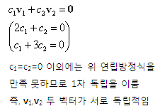
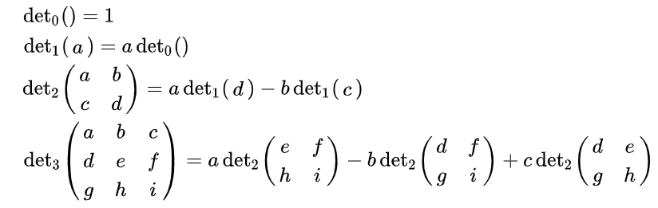
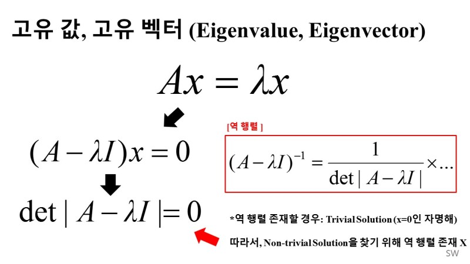

# 선형대수학

##  텐서

### 정의

- 숫자의 다차원 배열
- RGB 이미지는 3차원 텐서
- CNN에서 미니배치르르 통해 이미지를 공급하는 것에는 4차원 텐서

## 벡터의 내적

### 정의

- 두 벡터의 내적은 서로 대응하는 구성 요소의 곱의 합

## 벡터와 행렬 작업

- 행렬에 벡터를 곱하면 또 다른 벡터가 결과로 나옴
- 행렬 A와 X의 곱셈을 통해 생성된 새로운 벡터 b는 A와 같은 열 벡터 차원을 가진다

## 벡터의 일차독립

### 정의

- 벡터가 다른 벡터의 선형 조합으로 표현될 수 있다면 벡터는 다른 벡터에 일차독립

  

- c1 = c2 = 0 인 경우 외에 연립 방정식을 만족하는 경우가 있으면 `일차종속` 이라고 한다

---

## 행렬식

### 정의

- 정사각행렬에 수를 대응시키는 함수의 하나

  

- 행렬식이 0인 경우 역행렬이 없다

---

## 벡터의 놈

### 정의

- 벡터 크기의 척도

### 놈의 종류

- 맨해튼 놈(1차 놈)

  

- 유클리드 놈(2차 놈)

  

- 맥시멈 놈

  

---

## 고유벡터, 고유값

### 정의

- A의 고유벡터 X에 행렬 A를 곱해준 것이 고유벡터 X에 일개 상수인 고유 값 람다를 곱해준 것과 같은 것을 의미

 출처 : https://bskyvision.com/59

- 수식을 왼쪽으로 몰고 계산시, `A-람다 * 단위행렬 = 0`을 만족하는 람다
- 

### 역행렬의 고유값과 고유벡터

- 역행렬의 고유값은 A의 고유값들의 역수와 같다
- 고유벡터들은 동일하다

### 페이지 랭크 알고리즘

- A, B, C라는 페이지가 있다
- 원본페이지에서 다음 페이지에 대한 링크가 있다면 다른 페이지로 이동이 가능하다
- A -> B로 이동하면 B/A 라고 표기한다
- `P(B/A)` 는 `B/A` 를 `A에 대한 총방문 수`로 나눈 값
- 어떤 페이지가 일정하게 유지될 확률은 나가는 확률과 들어올 확률 질량이 같아야 한다
- A페이지에대한 확률
  - P(A/A)P(A) + P(A/B)P(B) + P(A/C)P(C) = P(A)
  - A페이지에서 나오는 확률
    - P(B/A)P(A) + P(C/A)P(A)
  - A페이지로 들어갈 확률
    - P(A/B)P(B) + P(A/C)P(C)
  - A페이지에 남을 확률
    - P(A/A)P(A)
- A, B, C에 대해서 구하고 행렬로 나타낼 수 있다
- 이것을 행렬로 나타내면 Ax = x 형태로 나타나고 고유값은 1이 된다